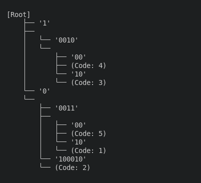
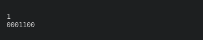
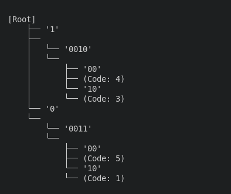

<h1 align="center" style="font-weight: bold;">Trabalho Prático de Algoritmos 2</h1>

 <a href="#tech">Tecnologias</a> • 
 <a href="#intro">Introdução</a> • 
 <a href="#métodos">Métodos e Implementações</a> •
 <a href="#comdes">Funcionamento de Compressão e Descompressão</a> •
 <a href="#testes">Testes e Análise</a> • 
 <a href="#inst">Instruções de Uso</a> • 
  •

    <b>Este projeto implementa o algoritmo LZW para compressão e descompressão de arquivos, utilizando uma Trie Compacta como estrutura de dados para armazenamento eficiente dos padrões.</b>

<h2 id="tech"> Tecnologias</h2>

- C++ 
- Python 

<h2 id="intro">Introdução</h2>
    O algoritmo LZW é uma extensão do algoritmo LZ78, com a principal diferença de que o LZW é inicializado com todos os símbolos do alfabeto das cadeias de entrada. Essa modificação permite que o algoritmo seja mais eficiente no processamento de dados, ao eliminar a necessidade de codificar explicitamente os símbolos isolados durante a compressão.

<h2 id="métodos">Métodos e Implementações</h2>
    Este projeto foi desenvolvido em três etapas principais: (1) a implementação do dicionário, (2) a implementação do algoritmo LZW para compressão e descompressão de dados com tamanho fixo, e (3) a implementação do algoritmo LZW para dados de tamanho variável. Todas as funcionalidades implementadas, bem como as escolhas de projeto, serão detalhadas nas seções a seguir.
<h3>Dicionário</h3>
<h4>Estrutura Geral</h4>
    

    O dicionário foi implementado utilizando uma árvore de prefixos compacta. Essa abordagem reduz o consumo de memória ao representar cadeias longas, graças à compactação dos nós, e minimiza operações redundantes. A busca por palavras é realizada percorrendo as arestas da árvore, permitindo um acesso eficiente aos dados armazenados.
    

    

    Foram utilizadas duas classes ao todo. A primeira <code>TrieNode</code>, é responsável por representar os nós da árvore. Cada nó armazena duas informações: os filhos, que indicam se existem possíveis continuações para a cadeia armazenada no nó atual e o código único associado, utilizado para referenciar e diferenciar cada padrão. E a segunda <code>Dicionario</code>, é responsável por gerenciar a árvore de prefixos compacta, além de conectar essa estrutura à funcionalidade de um dicionário ao permitir que seja possível buscar palavras, retornar seus códigos associados, inserir novos padrões e remover entradas existentes.
    

<h4>Funções Principais:</h4>
  <ul>
    <li>Dicionario() e ~Dicionario()</li>
    
 
    O construtor <code>Dicionario()</code> é responsável por inicializar a estrutura de dados, criando a raiz da árvore e conectando-a a dois filhos, um com o valor "0" e outro com o valor "1". Essa implementação está relacionada ao algoritmo LZW, que é inicializado com todos os simbolos do alfabeto das cadeias de entrada. Na nossa implementação, apenas esses dois caracteres são adicionados, pois estamos adotando uma implementação que aceitará e retornará cadeias binárias. O destrutor <code>~Dicionario</code> garante a liberação de memória, percorrendo e removendo todos os nós da árvore, evitando vazamentos de memória.
    
 
    <li>void insert(const string& palavra, const string& codigo)</li>
    

    A função <code>insert()</code> é responsável por inserir novas palavras no dicionário. Para manter a estrutura da Trie Compacta, a inserção é feita da seguinte forma: a partir da raiz, o algoritmo verifica se algum dos filhos começa com o mesmo caractere da palavra que queremos adicionar, o que certamente ocorrerá devido à inicialização mencionada anteriormente. Em seguida, o algoritmo verifica se é possível agrupar prefixos em comum com os nós já existentes. Para cada filho, é analisado quanto do prefixo da palavra é comum ao valor da aresta do nó. Se nenhum filho correspondente for encontrado, o nó atual é atualizado para incluir a nova palavra e o código, criando um novo nó. Caso um filho correspondente seja encontrado, duas situações podem ocorrer: se o tamanho do prefixo comum for igual ao tamanho da aresta, o índice da palavra é avançado e o processo continua; se o prefixo comum for menor que o tamanho da aresta, o nó atual é dividido para manter a estrutura compacta.
    

    <li>bool countTrie(const std::string& chave)</li>
    

    A função <code>countTrie</code> verifica, de forma recursiva, se a chave especificada está presente na Trie. Ela percorre os nós e verifica a chave associada, e retorna <code>true</code> caso a chave seja encontrada. Caso contrário, retorna <code>false</code>.
    

    <li>string getPalavra(const string& chave);</li>
    

    A função <code>getPalavra</code> percorre recursivamente os nós da Trie, verificando se a chave fornecida corresponde a uma chave armazenada. Se a chave for encontrada, a função retorna a palavra associada a ela. Caso contrário, retorna uma string vazia.
    

    <li>bool clear(const string& chave);</li>
    

    A função <code>clear()</code> remove todos os nós da estrutura do dicionário, similar ao comportamento do destrutor da classe, e recria uma nova raiz para a Trie. Essa funcionalidade é especialmente útil nas operações de compressão e descompressão de textos com mais de 4000 caracteres, onde é necessário reinicializar o dicionário para continuar o processamento.
    

    </ul>
<h4>Exemplos de Uso</h4>
<ul>
<li>Inserção</li>
<pre><code= cpp>
int main(){
    Dicionario dic;
    dic.insert("0001110", "1");
    dic.insert("0100010", "2");
    dic.insert("1001010", "3");
    dic.insert("1001000", "4");
    dic.insert("0001100", "5");
    dic.printTrie();
    return 0;
}
</code></pre>

<li>Busca</li>
<pre><code>
int main(){
    Dicionario dic;
    dic.insert("0001110", "1");
    dic.insert("0100010", "2");
    dic.insert("1001010", "3");
    dic.insert("1001000", "4");
    dic.insert("0001100", "5");
    cout << dic.countCode("5") << endl;
    cout << dic.getPalavra("5") << endl;
    return 0;
}
</code></pre>

<li>Remoção</li>
<pre><code>
int main(){
    Dicionario dic;
    dic.insert("0001110", "1");
    dic.insert("0100010", "2");
    dic.insert("1001010", "3");
    dic.insert("1001000", "4");
    dic.insert("0001100", "5");
    cout << dic.countCode("5") << endl;
    cout << dic.getPalavra("5") << endl;
    return 0;
}
</code></pre>

</ul>
<h3>LZW de tamanho fixo</h3>
<h3>LZW de tamanho variável</h3>
<h2 id="instrucoes"> Instrucoes de Uso</h2>
<h2 id="testes"> Testes</h2>
<h2 id="colab"> Responsáveis</h2>
<table>
  <tr>
    <td align="center">
      <a href="#">
         
        
          <b>Déborah Yamamoto</b>
        
      </a>
    </td>
    <td align="center">
      <a href="#">
         
        
          <b>Caroline Carvalho</b>
        
      </a>
    </td>
  </tr>
</table>
    